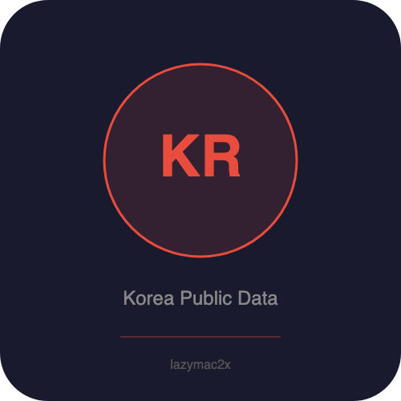

<p align="center"></p>

[](https://lazymac2x.github.io/lazymac-api-store/) [](https://coindany.gumroad.com/) [](https://mcpize.com/mcp/korea-public-data-api)

# Korea Public Data API

[](https://www.npmjs.com/package/@lazymac/mcp)
[](https://smithery.ai/server/lazymac/mcp)
[](https://coindany.gumroad.com/l/zlewvz)
[](https://api.lazy-mac.com)

> 🚀 Want all 42 lazymac tools through ONE MCP install? `npx -y @lazymac/mcp` · [Pro $29/mo](https://coindany.gumroad.com/l/zlewvz) for unlimited calls.

Unified REST API + MCP server for Korean public data. No API keys required.

## Data Sources

| Endpoint | Source | Auth |
|----------|--------|------|
| Weather | wttr.in | None |
| Exchange Rates | open.er-api.com | None |
| Holidays | date.nager.at | None |
| Transport | Static + real-time logic | None |
| Stocks | Yahoo Finance | None |

## Quick Start

```bash
npm install
npm start
# Server runs on http://localhost:3200
```

## API Endpoints

### Weather

```
GET /api/v1/weather              # List supported cities
GET /api/v1/weather/:city        # Get weather for a city
```

Supported cities: Seoul, Busan, Jeju, Incheon, Daegu, Daejeon, Gwangju, Ulsan, Suwon, Changwon, Jeonju, Chuncheon, Gangneung, Pohang, Yeosu

### Exchange Rates

```
GET /api/v1/exchange             # All KRW rates
GET /api/v1/exchange/:currency   # Specific rate (USD, EUR, JPY, CNY, etc.)
```

### Holidays

```
GET /api/v1/holidays/:year       # Korean public holidays for a year
```

### Transport

```
GET /api/v1/transport/seoul/status   # Seoul subway & bus status
```

### Stocks

```
GET /api/v1/stocks/summary       # KOSPI & KOSDAQ index data
```

## MCP Server

Use as a Model Context Protocol server for AI assistants:

```json
{
  "mcpServers": {
    "korea-public-data": {
      "command": "node",
      "args": ["src/mcp-server.js"]
    }
  }
}
```

### Available Tools

- `get_korea_weather` — Weather for Korean cities
- `get_exchange_rate` — KRW exchange rate for a currency
- `get_all_exchange_rates` — All KRW exchange rates
- `get_korean_holidays` — Korean public holidays by year
- `get_seoul_transport_status` — Seoul subway/bus status
- `get_korean_stock_market` — KOSPI/KOSDAQ summary

## Docker

```bash
docker build -t korea-public-data-api .
docker run -p 3200:3200 korea-public-data-api
```

## License

MIT

## Related projects

- 🧰 **[lazymac-mcp](https://github.com/lazymac2x/lazymac-mcp)** — Single MCP server exposing 15+ lazymac APIs as tools for Claude Code, Cursor, Windsurf
- ✅ **[lazymac-api-healthcheck-action](https://github.com/lazymac2x/lazymac-api-healthcheck-action)** — Free GitHub Action to ping any URL on a cron and fail on non-2xx
- 🌐 **[api.lazy-mac.com](https://api.lazy-mac.com)** — 36+ developer APIs, REST + MCP, free tier

<sub>💡 Host your own stack? <a href="https://m.do.co/c/c8c07a9d3273">Get $200 DigitalOcean credit</a> via lazymac referral link.</sub>
